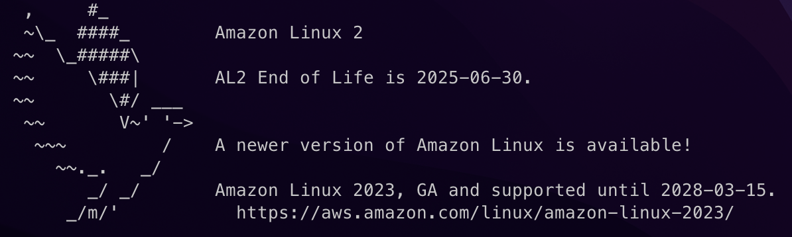

# CloudFormation-Beginners-Handson
CloudFormation入門者用のハンズオンを改良したテンプレートファイルです。


## 概要
CloudFormationの入門ハンズオンを改良したものです。
参考にした記事は下に記載をしています。
プラスアルファでいくつか設定を変更しています。

## 参考にした記事
CloudFormation入門者にはとてもわかりやすい記事でした。

【AWS入門】CloudFormation【ハンズオン】
https://devlog.neton.co.jp/middleware/cloudformation/

## この記事を実践する前に気をつけること
- 作業するリージョンの確認：
  (私の場合は東京リージョン用に変更して作業をしました)
- ami-idを変更する。
  記事のままのami-idを指定しても動かないので調べて変更する。
- pemファイルをダウンロードしたらパーミッションを変更する。

## プラスアルファで加えた変更
- 東京リージョンに作成するように変更
- VPCのCidrBlockを10.0.0.0/16に変更
- セキュリティグループを2つに分割して各インスタンスに異なるセキュリティグループを設定
- パブリックサブネットのEC2インスタンスにElasticIPを割り当てるように変更
- カスタムネットワークACLを設定

## 動作確認に使用するコマンド
最終的に、プライベートサブネット内のEC2インスタンスにSSH接続するために使用するコマンドです。

```Bash

# ホストマシンからリモートマシンにpemファイルを転送する
scp -i testkeypair.pem -r testkeypair.pem ec2-user@<Elastic IP Address>:/tmp

# パブリックサブネットにssh接続する
ssh -i testkeypair.pem ec2-user@<Elastic IP Address>

# プライベートサブネットにssh接続する
ssh -i /tmp/testkeypair.pem ec2-user@<Private IP Address>

```

## 追記：自動で新しいami-idを取得するように変更
ami nameの探し方
1. AWS CLI を使用してパブリックパラメータを検索する
https://docs.aws.amazon.com/ja_jp/systems-manager/latest/userguide/parameter-store-finding-public-parameters.html
<br>
``` bash
aws ssm get-parameters-by-path --path /aws/service/list
```
以下のような結果が得られる。
```bash
{
  "Name": "/aws/service/list/ami-amazon-linux-latest",
  "Type": "String",
  "Value": "/aws/service/ami-amazon-linux-latest/",
  "Version": 1,
  "LastModifiedDate": "2021-03-12T08:07:37.393000+09:00",
  "ARN": "arn:aws:ssm:ap-northeast-1::parameter/aws/service/list/ami-amazon-linux-latest",
  "DataType": "text"
},
```
2. 上記をもとにさらに検索する。
```bash
aws ssm describe-parameters --parameter-filters "Key=Name, Option=BeginsWith, Values=/aws/service/ami-amazon-linux-latest/" --region ap-northeast-1
```

以下のような結果が得られる。

```bash
{
  "Name": "/aws/service/ami-amazon-linux-latest/amzn2-ami-kernel-5.10-hvm-x8
6_64-gp2",
  "Type": "String",
  "LastModifiedDate": "2023-12-20T03:21:22.578000+09:00",
  "Version": 56,
  "Tier": "Standard",
  "Policies": [],
  "DataType": "text"
},
```
上記のNameをもとに、ami-idを取得する。

